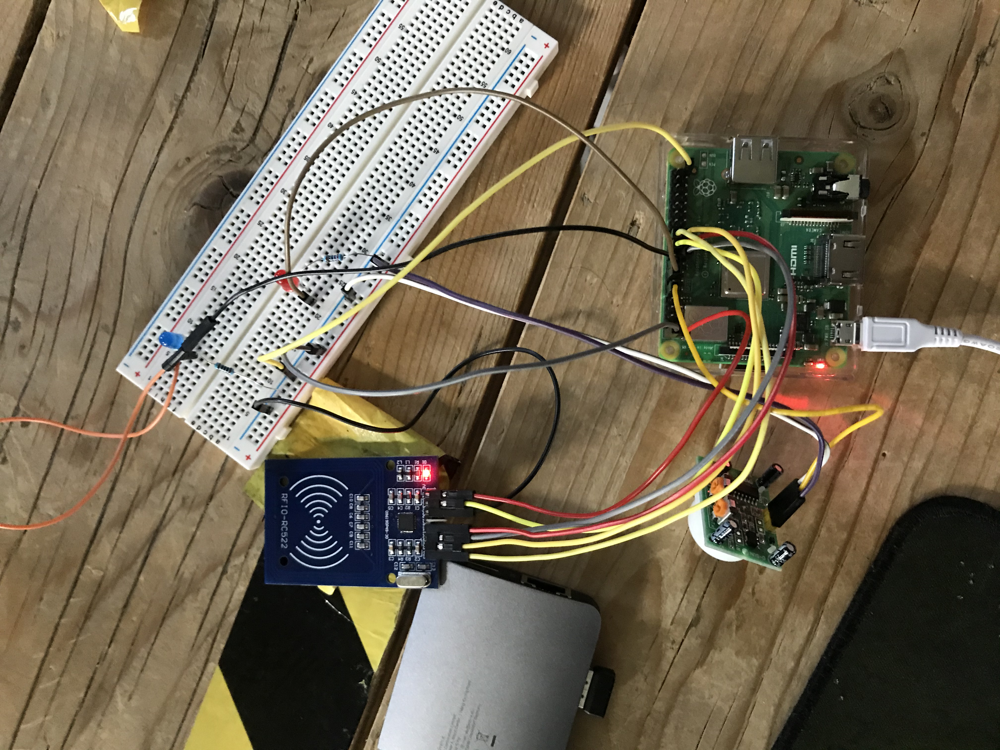

# BeAware Raspberry Pi

Team :
- Robin Bigeard
- Thomas Mary
- Maxime Grand
- Antoine Leblanc  



## Requirements :
- Git (clone project *optional)
- FileZila (optional)
- SSH
- SD Card
- Raspberry Pi
- Motion sensor - PIR HC-SR501
- RFID read / write - RFIO-RC522 and badge
- 2 LED Red / Blue and 2 Resistors
- Speaker with jack
- Cables


## Install Rapbian OS to SD card and configure Wifi
https://www.seeedstudio.com/blog/2021/01/25/three-methods-to-configure-raspberry-pi-wifi/

## Share you network (optional) :


```
ssh pi@192.168.137.161
// Authentificate 
// user : pi 
// password : raspberry
pi$ ~ mkdir tp 
```

## Transfert script to Raspberry Pi with FileZilla or other


Transfert files in `tp` folder :
- alarm.py
- alarm.service
- alarm.wav
- requierement.txt


## Install dependency :
```
sudo apt-get update
sudo apt-get upgrade
cd tp
pip3 install -r requierement.txt
```

## Configure Raspberry Pi :
```
# confi
sudo raspi-config

Active Sound
// System Options > Audio > Select your speaker

# Manage sound volume
alsamixer
```

## Import credential authentication for Firebase
https://cloud.google.com/docs/authentication/getting-started
```
export GOOGLE_APPLICATION_CREDENTIALS=/home/pi/tp/BeAware-3d38a27421cd.json
```

## Execute scripte :
```
python3 alarm.py
```

## Schema Database 


## Schema Raspberry Pi 


## Systemctl / Start program lunch of the Raspberry Pi
```
cp alarm.service /etc/systemd/system/alarm.service  
sudo systemctl start alarm.service
sudo systemctl status alarm.service
# if error
sudo journalctl -e
sudo systemctl enable alarm.service
# other commands : disable, stop
```
